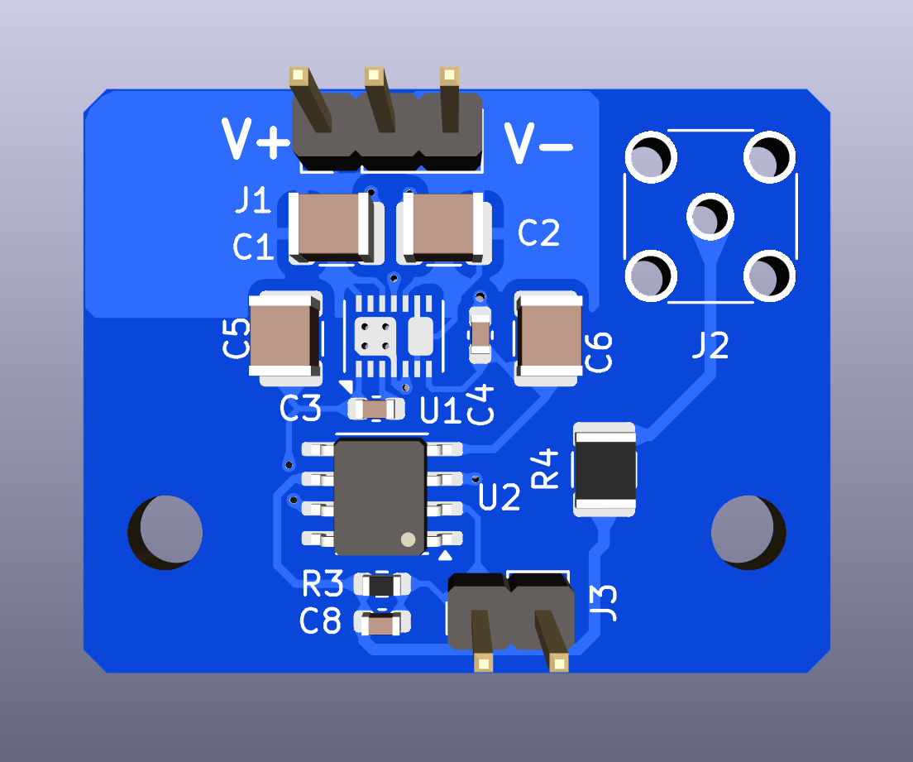

[](https://github.com/TU-Darmstadt-APQ/MOT_Photodiode/releases/latest)
[](https://github.com/TU-Darmstadt-APQ/MOT_Photodiode/actions/workflows/ci.yml)

# MOT Photodiode
This is a photodiode board with a transimpedance amplifier for [S-25](https://osioptoelectronics.com/products/photodetectors/solderable-chip-photodiodes/s-25cl) photodiodes used to probe the MOT beams at the QUIPS C experiment.

## Contents
- [Introduction](#introduction)
- [Design files](#design-files)
- [Related repositories](#related-repositories)
- [Versioning](#versioning)
- [License](#license)



## Introduction
The photodiode board features a single-stage amplifier and a voltage regulator to power the op-amp. The power supply required needs to provide +-15 V via a pin header. The bandwidth of the system is about 10 kHz. For details see [here](datasheet/bandwidth.png).


## Design files
### For production
The design files required for the PCB production and assembly can be found on the [releases](../../releases) page and include the following resources:

- Schematics as a PDF
- Gerber files
- Pick & place position files
- Bill of materials as a CSV file and also as an interactive HTML version
- Mechanical design files for manufacturing the housing as PDF

The latest revision of those files can be found [here](../../releases/latest).

### For editing
To work on the [KiCad](https://www.kicad.org/) design files, a number of external libraries are needed. Those libraries show up as empty folders in the zip file, because they are not included in the release, but must be downloaded separately from the links given [below](#related-repositories). This can be avoided by checking out the whole repository using git. This way the libraries will be downloaded as well. Use the following command to clone the git repository along with the submodules  using the `--recurse-submodules` flag.
```
git clone --recurse-submodules https://github.com/TU-Darmstadt-APQ/MOT_Photodiode.git
```

## Related repositories
See the following repositories for more information as these are part of the [design files](#design Files).

- [KiCad footprints](https://github.com/PatrickBaus/footprints.pretty)
- [KiCAD 3D models](https://github.com/PatrickBaus/footprints.3dshapes)
- [KiCAD schematic libraries](https://github.com/PatrickBaus/KiCad-libraries)

## Versioning
I use [SemVer](http://semver.org/) for versioning. For the versions available, see the [tags](../../tags) available for this repository.

- MAJOR versions in this context mean a breaking change to the external interface of the hardware like different connectors or functions.
- MINOR versions contain changes to the hardware that only affect the inner workings of the circuit, but otherwise the performance is unaffected.
- PATCH versions do not affect the schematics or invalidate older bill of materials. These changes may include updated components (to replace obsolete parts for example), an updated silkscreen, or fixed typos.

## License
This work is released under the CERN-OHL-W
See [https://ohwr.org/cern_ohl_w_v2.pdf](https://ohwr.org/cern_ohl_w_v2.pdf) or the included [LICENSE](LICENSE) file for more information.
